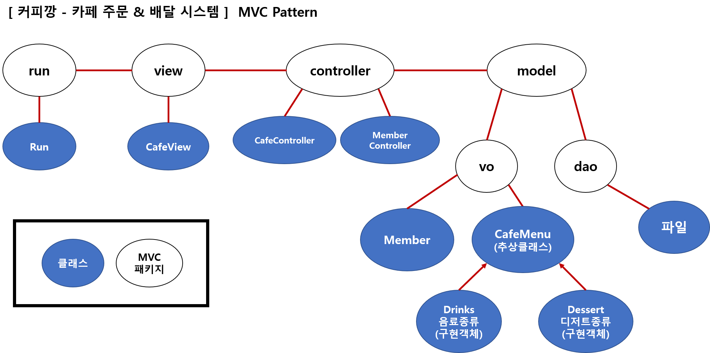
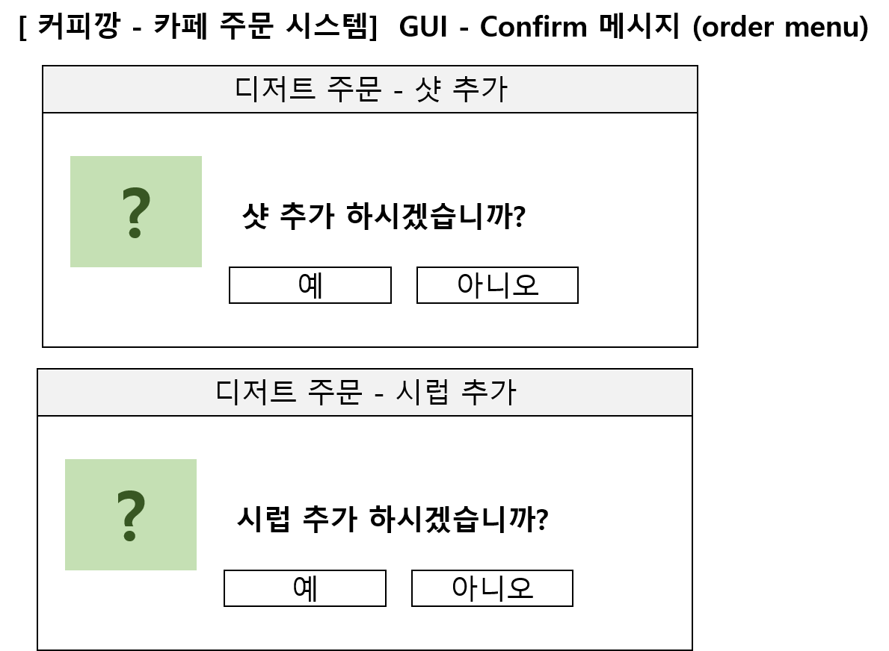

# 미니 프로젝트

> ## 주제: 커피 배달 & 주문 시스템
> ## 팀명: 커피 깡

- Language: Java
- 팀원: <strong>이영실</storng> , 김수진 , 최은강

> ## 팀원 작성 코드

- [이영실](./LYS)
- [김수진](./KSJ)
- [최은강](./CEK)

> ## 최종 코드

- [ GUI - 알림메시지 ] (./CoffeeKKang/GUI_AlertMessage/)

> # MVC Pattern

> # Class Diagram

> # GUI description

### 1. 로그인 이전 GUI 화면

### 2. 로그인 이전 에러메시지 GUI 화면

### 3. 로그인 이후 GUI 화면

### 4. 주문하기 GUI 화면

### 5. 마이페이지 조회 GUI 화면

### 6. 주문내역 및 쿠폰 조회 GUI화면 & (비밀번호/ 이름 / 생일 / 주소) 변경 GUI 화면
- 주문내역 및 쿠폰 조회

- 비밀번호 변경

- 이름 변경

- 생일 변경

- 주소 변경

### 7. Dialog 메시지 - 알림 메시지(alert Messages)

- JOptionPane 을 이용하여, 옵션에 따른 알림 메시지를 나타낸다.

- 디저트 주문 확인 메시지 (김수진)

 

- 로그인 실패 메시지 (이영실)

 

- 마이 페이지 (최은강)

